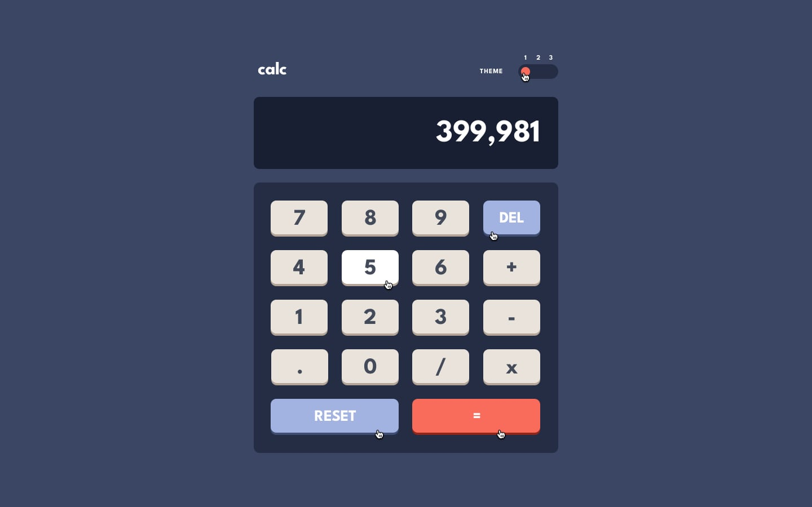
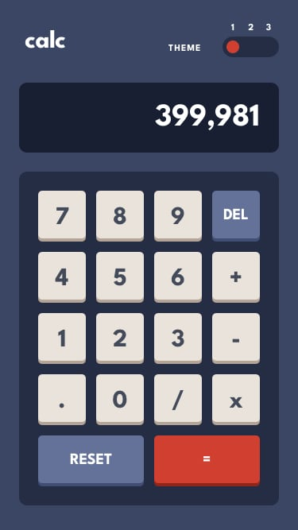

# Frontend Mentor - Calculator app solution

This is a solution to the [Calculator app challenge on Frontend Mentor](https://www.frontendmentor.io/challenges/calculator-app-9lteq5N29). Frontend Mentor challenges help you improve your coding skills by building realistic projects. 

## Table of contents

- [Overview](#overview)
  - [The challenge](#the-challenge)
  - [Screenshots](#screenshots)
  - [Links](#links)
- [My process](#my-process)
  - [Built with](#built-with)
  - [Useful resources](#useful-resources)
- [Acknowledgements](#acknowledgements)
- [Author](#author)

## Overview

### The challenge

Users should be able to:

- See the size of the elements adjust based on their device's screen size
- Perform mathmatical operations like addition, subtraction, multiplication, and division
- Adjust the color theme based on their preference
- **Bonus**: Have their initial theme preference checked using `prefers-color-scheme` and have any additional changes saved in the browser

### Screenshots

  
   

  
   

  
   

  
  
  

### Links

- Solution URL: 
- Live Site URL: [https://frontend-mentor-calculator-app-rouge.vercel.app/](https://frontend-mentor-calculator-app-rouge.vercel.app/)
- All Solutions URL: [https://frontend-mentor-solutions-mu.vercel.app/](https://frontend-mentor-solutions-mu.vercel.app/)

## My process

### Built with

  
  
  
    

### Useful resources

- 
 
## Acknowledgements

- Challenge was provided by [Frontend Mentor](https://www.frontendmentor.io)

## Author

  
  
   
  

